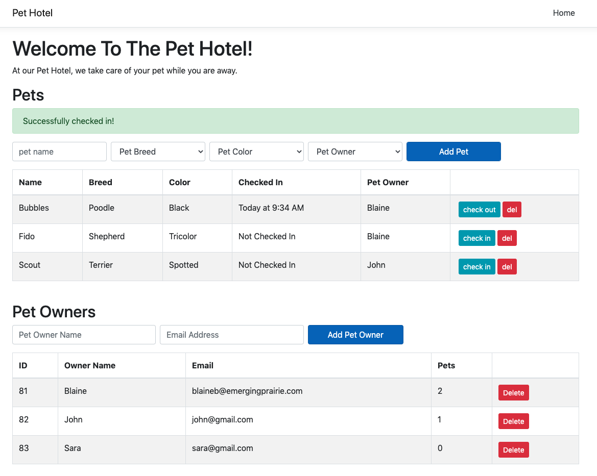
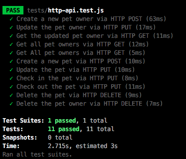

# Pet Hotel

This is a standard c-sharp project that was started with `dotnet new react --no-https -o project-name`. In addition:

  - Startup.cs has been updated so that `npm start` is not run in the background. Instead you must run `npm start` from the `ClientApp/` folder separately.
  - Postgres support is added and ready to go. The connection string can be updated in `appsettings.json`.
  - `package.json` stub has been added at the root level. This file exists only to satisfy the nodejs buildpack on heroku. It is not used in any way for the project.
  - `ClientApp/` has been updated to include react, redux, momentjs, and axios. `cd ClientApp && npm install` and away you go.

The client is available at `http://localhost:3000` and set up to proxy 
back to the dotnet API. The dotnet API is available at `http://localhost:5000/` and ALSO set up to proxy non-api requests to the webpack server. Both should work, although the convention for dotnet is to go directly through the dotnet app @ `http://localhost:5000`.

Please Note: If you get a 'Request failed with status code 431' error, this is likely a red herring (not a real error).
It is likely caused because your controllers do not have any valid routes set up yet.

## Screenshots
### Pet Hotel UI (working with base goals met)


### Passing Tests (npm test)


## Project Requirements

Your job is to build the backend for the Pet Hotel! The React App is
ready to go. For base mode you do not need to update the React App at all. Simply `cd` into the `ClientApp/` folder, run `npm install`, and 
`npm start` to run the client application. Build the HTTP API until all of the functionality of the Client App is working:

   - All 11 jest tests are passing (see below)
   - Loading the page shows Pets and Pet Owners in the table.
   - User can add a new Pet Owner (and see error validations).
   - User can add new Pets, associated with pet owners (and see error validations).
   - User can check in a pet and see the timestamp on the table.
   - User can check out a pet.
   - User can delete pets.
   - User can delete pet owners.

Your general approach should be like so:

   1. Create your models
   2. Add them to your ApplicationContext
   3. Migrate your database with `dotnet ef migrations` and `dotnet ef database update`
   4. Create your controllers
   5. Test controllers with PostMan and the jest tests
   6. Make sure the ReactApp is working appropriately

A recommended approach would be to start with PetOwners, since they're the simplest model. You should be able to get most of the model functioning, the controller working, and the endpoints working before starting on the Pet model.

### Stretch Goals

  - Have fun with the styling! Change things around, swap colors/fonts/textures, etc. 
  - Create a new resource: `Transaction`. This transaction tracks the history of the hotel. A new transaction is created whenever a pet is checked in or checked out, a pet is created or deleted, or a pet owner is created or deleted, etc. It could be a simple timestamp and string of what happenens.
    - Create the model
    - Add the model to the ApplicationContext
    - Create the database migration
    - Create the controller
    - Create the relevant jest tests
    - Show all recent transactions in the react app.
  - Add a profile image to your pets (via internet URL) or a drop-down of available URLs. You'll need to add the field and migration for the new field. Consider Updating the tests to check that images make it!
  - Use the model validations returned from the server to highlight which fields have the validation error. Hint: The error coming back will often contain the field name, which will match the name of the element on the form. See sourdough bakery for examples (the React App already has plumbing for default validation message format).
  - Add the ability to edit pet names
  - Add the ability to edit pet owners' name, email address
  - Add pagination to one (or all) of the resources. You can do this with optional parameters: `/api/petowners/?start=0&limit=10`, next page: `/api/petowners/?start=10&limit=10` etc. `Transaction` would benefit greatly from this.
  - Move alerts up to global redux state and share alert state between the tables
  - Move alerts to be 'toasts': they show up in the corner and auto-dismiss themselves after 5 seconds.
  - Prevent the PetOwner from being deleted if they have any pets that are checked in.
  - If a pet is deleted and their owner no longer has any pets in the hotel, delete the owner too.
  - Add a 'Are you sure?' prompt to the delete buttons on the client app.
  - Add additional tests to test for proper validation errors.
  - Deploy to Heroku using the dotnet buildpack (See cohort notes for more info).

## HTTP API Requirements

The client app is already set up with certain expectations from the API. ***DO NOT*** update the client app API requests for base mode. If you find yourself needing to update the client app in any way, it is proably a sign that your API is not meeting the basic requirements.

The .NET Core WebAPI controllers will (by default) respond to GET requests with any `Content-Type`, but any requests with a JSON body (POST/PUT) will require an HTTP Header of `Content-Type: application/json`. Remember that Axios does this for you.

For all API requests, return a `2xx` status code on success: 200 for GET/PUT, 201 for POST, 204 for DELETE. POST and PUT requests should always return the created or updated object for consistency. See the jest tests for more details.
A `4xx` status code should be used for errors (`404` if model with id is not found, `403` if there are validation errors, etc).

For all API requests that require an id in the URL, the format `/api/resource/:id` is used. For example, to delete a pet with a primary key of `5`, you would use `DELETE /api/resource/5`.

### Jest Tests

This project is ready to go with a suite of tests that hit the expected endpoints and check the reponses. Once all tests pass, your job is done! The tests are set up in the `ClientApp/` folder. Run `npm test` to run the tests. See `ClientApp/tests/http-api.test.js` for more information. Study the tests to see how the API is meant to be used!

### Pet Owner Object

The Pet Owner object is very simple, consisting of just four fields:

  - `int id`: primary key
  - `string name` (required): the name of the pet owner
  - `string emailAddress` (required, validated format): the email address of the pet owner
  - `int petCount`: The number of pets owned by this person. This is not a database column, but a dynamically generated field based on the count of foreign keys that point to this owner in the database. See the `[NotMapped]` model attribute for more information. Consider using an entity-mapped `List<Pet>` property to keep track of this, utilizing the `[JsonIgnore]` attribute to prevent a circular reference on the outgoing API serialization.

A Pet Owner Object looks like this:

``` json
{
  "id" : 1,
  "emailAddress" : "asdf@asdf.com",
  "name" : "blaine",
  "petCount" : 1
}
```

### Pet Object

The Pet Object contains basic information about a pet, including physical properties, owner information, and check-in information.

  - `int id`: primary key
  - `string name` (required): The pet name
  - `PetBreed breed` (required): Pet breed, based on the `PetBreed` enum.
  - `PetColor color` (required): Pet color, based on the `PetColor` enum.
  - `DateTime checkedInAt` (nullable): The time that this pet was checked in. If `null`, the pet has not been checked in yet.
  - `int petOwnerid` (required): A foreign key link to the pet owner that owns this pet. Set up the foriegn key link with a `PetOwner petOwner` property on the `Pet` model.

 A Pet Object looks like this:

``` json
{
  "name" : "Fido",
  "color" : "White",
  "checkedInAt" : "2020-07-21T03:17:58.917069",
  "petOwnerid" : 1,
  "id" : 1,
  "breed" : "Beagle",
  "petOwner" : {
      "id" : 1,
      "petCount" : 1,
      "emailAddress" : "asdf@asdf.com",
      "name" : "blaine"
  }
}
```

### PetBreed and PetColor Enums

Ideally you will create a PetBreed Enum and PetColor Enum to limit the available options. 

  - PetBreed: Must contain at least: `Shepherd`, `Poodle`, `Beagle`, `Bulldog`, `Terrier`, `Boxer`, `Labrador`, `Retriever`, 
  - PetColor: Must contain at least: `White`, `Black`, `Golden`, `Tricolor`, `Spotted`

### Pet Owner API
`/api/petowners` is the base URL for the Pet Owner API

`GET /api/petowners/` should return a list of pet owner objects. A Pet Owner should have a read-only `petCount` field that contains the number of pets that belong to the pet owner.

`GET /api/pets/:id` should return the `PetOwner` object with the given id.

`POST /api/petowners/` should create a new pet object. The body of the HTTP post should contain the `PetOwner` object in JSON format with all required fields.

`DELETE /api/petowners/:id` should delete the Pet Owner with the given primary key (id).

`PUT /api/petowners/:id` should update the Pet Owner with the given primary key (id). The HTTP Body should include the entire Pet Owner object to be updated with all required keys, including the `id`.

### Pet API
`/api/pets` is the base URL for the Pet Owner API.

`GET /api/pets` should return a list of pet objects. Each pet should contain a nested `petOwner` field that contains the full `PetOwner` object that owns this pet. Be sure that the `PetOwner` object does not additionally curcularly reference the pets owned.

`GET /api/pets/:id` should return the pet object with the given id.

`POST /api/pets` should create a new pet object. The body of the HTTP post should contain the `Pet` object in JSON format with all required fields. The `Pet` object should contain a reference to a `PetOwnerId`, which is the primary key of the `PetOwner` that the pet belongs to.

`PUT /api/pets/:id` should update the `Pet` with the given primary key (id). The HTTP Body should include the entire `Pet` object to be updated with all required keys, including the `id`.

`DELETE /api/pets/:id` should delete the pet with the given id.

`PUT /api/pets/:id/checkin` should check in a pet with given id. Checking in will set the `checkedInAt` field to an ISO8601 timestamp that set to the current time.

`PUT /api/pets/:id/checkout` should check out the pet with the given id. Checking out simply resets the `checkedInAt` field to `null`.

## HTTP Endpoint Examples

These examples use the command line `curl` to execute the HTTP calls directly against the server. You can copy and paste these commands and run them locally to compare outputs. The optional tool `json_pp` (JSON Pretty Print) is used to format the JSON output. `brew install curl json_pp` will install both `curl` and `json_pp` if they are not already installed on your mac. Linux users: `apt-get install curl json_pp`.

### Create a Pet Owner

``` bash
curl -H "Content-Type: application/json" -X POST --data '{"name": "Frank Zappa", "emailAddress": "frank@zappamusic.org"}' http://localhost:5000/api/petowners/ 2>/dev/null | json_pp
{
   "id" : 76,
   "name" : "Frank Zappa",
   "emailAddress" : "frank@zappamusic.org",
   "petCount" : 0
}
```

### Creating a pet associated with the pet owner
``` bash
$ curl -H "Content-Type: application/json" -X POST --data '{"name": "Fido", "breed": "bulldog", "color": "Black", "petOwnerid": 76}' http://localhost:5000/api/pets 2>/dev/null | json_pp
{
   "id" : 40,
   "petOwner" : {
      "petCount" : 1,
      "name" : "Frank Zappa",
      "id" : 76,
      "emailAddress" : "frank@zappamusic.org"
   },
   "breed" : "Bulldog",
   "petOwnerid" : 76,
   "checkedInAt" : null,
   "name" : "Fido",
   "color" : "Black"
}
```

### Checking in the pet

``` bash
$ curl -H "Content-Type: application/json" -X PUT --data '' http://localhost:5000/api/pets/40/checkin 2>/dev/null | json_pp
{
   "name" : "Fido",
   "petOwner" : null,
   "id" : 40,
   "checkedInAt" : "2020-07-21T03:35:23.880902Z",
   "breed" : "Bulldog",
   "petOwnerid" : 76,
   "color" : "Black"
}
```

### Checking out the pet

``` bash
$ curl -H "Content-Type: application/json" -X PUT --data '' http://localhost:5000/api/pets/40/checkout 2>/dev/null | json_pp
{
   "checkedInAt" : null,
   "id" : 40,
   "name" : "Fido",
   "petOwnerid" : 76,
   "petOwner" : null,
   "color" : "Black",
   "breed" : "Bulldog"
}
```

### Deleting the Pet

``` bash
$ curl -H "Content-Type: application/json" -X DELETE -i http://localhost:5000/api/pets/44
HTTP/1.1 204 No Content
Date: Tue, 21 Jul 2020 03:39:12 GMT
Server: Kestrel
```

### Deleting the Pet Owner
```
$ curl -H "Content-Type: application/json" -X DELETE -i http://localhost:5000/api/petOwners/76
HTTP/1.1 204 No Content
Date: Tue, 21 Jul 2020 03:40:02 GMT
Server: Kestrel
```
